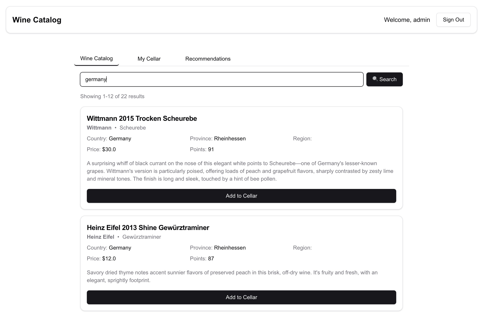

# `wineinfo`

A sample web application for Junction demos.

The app is a wine catalog that's built with a React frontend and multiple
FastAPI backend services to handle traditional full-text search, LLM-based
vector search, and saving bottles to a collection.

This demo focuses on dynamic discovery in Kubernetes. To make it easy to run
without being a Kubernetes whiz, it runs in a self-contained [`k3d`][k3d]
cluster.

To play with Junction configuration, we'll need a working Python environment.
Setting this up is the hardest part of the demo:

```bash
python3 -m venv .venv
.venv/bin/pip install --upgrade uv
.venv/bin/uv pip install -r backend/requirements.txt
```

To activate your virtualenv run `source .venv/bin/activate`.

To run the wineinfo service, you'll need `docker` and `kubectl` installed. This
README won't cover installing them. Once you've gotten both `docker` and
`kubectl` set up, install `k3d` by running:

```bash
curl -s https://raw.githubusercontent.com/k3d-io/k3d/main/install.sh | bash
```

or check out the [official k3d installation instructions][k3d-install]

[k3d]: https://k3d.io/
[k3d-install]: https://k3d.io/v5.7.4/#install-script

Once you've installed `k3d` (check that it works by running `k3d version`) you
can start the demo:

```bash
./deploy/wineinfo.sh
```

Once you're done, point your browser at <http://localhost:8010>, and you should
see the working Wineinfo site. Once you click around the site,
head to [the first part of the demo](demo/01_intro.md).


