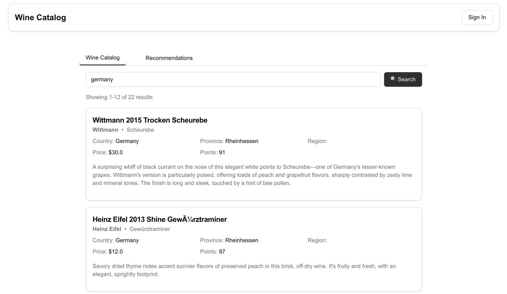

# Argo Rollouts

In this demo, we integrate Junction with [Argo
Rollouts][https://argoproj.github.io/rollouts/] and demonstrate how Junction
unlocks progressive delivery capabilities, without requiring a heavyweight
service mesh.

For those unaware, progressive delivery is a technique that gradually rolls out
software changes to a subset of users before full release, using feature flags
and canary deployments to minimize risk and enable quick rollbacks. 

Now, this may sound exactly like what we did in the routing demo. That is
correct, except Argo Rollouts allows us to put in place standard policies that
can be followed by the team for all rollouts to production, making sure they all
go through the same safety steps. No more YOLO.

In our case, we are going to put this policy on the catalog service's rollouts:
- Rollout to admin user, require explicit sign off before going our further
- Rollout to 1 node for all users, require 99% of requests to succeed before
  proceeding
- Rollout to all nodes.

## Setup

The setup here is a bit more complicated then the last. To install the Argo
controller, its command line tool, its CRDs, and its policies for manipulating
the Gateway API, run:

```bash
brew install argoproj/tap/kubectl-argo-rollouts
kubectl create namespace argo-rollouts
kubectl apply -n argo-rollouts -f https://github.com/argoproj/argo-rollouts/releases/latest/download/install.yaml
kubectl apply -f ./deploy/05_argo_rollouts_install.yaml
kubectl rollout restart deploy -n argo-rollouts
```

Now lets migrate the catalog service, to use Argo. This installs the new
Rollout, (without the policy) waits for it to scale up, deletes the Deployment,
then updates the Rollout so that going forward, all deployments must follow the
policy:

```bash
kubectl apply -f ./deploy/05_argo_rollouts_catalog_install.yaml
kubectl wait --for=condition=ready pod -l app=wineinfo,service=catalog --timeout=300s
kubectl delete deployment/wineinfo-catalog
kubectl apply -f ./deploy/05_argo_rollouts_catalog_policy.yaml
```

You can see the rollout now installed with:
```bash
$ kubectl argo rollouts get rollout wineinfo-catalog
```

So at this point we are in a similar place to demo 1, character encoding is once
again borked:



## Argo Rollouts to the (safe) rescue!

Lets kick off the deployment of the fix. Normally we would patch in a new
container version, in our case though we are using an environment variable to
simulate the changed behavior. So lets patch it in:
```bash
kubectl patch rollout wineinfo-catalog --type json -p '[{"op": "remove", "path": "/spec/template/spec/containers/0/env"}]'
```

The Argo Rollouts operator sees this, and starts our deployment, you can see
it with:
```bash
kubectl argo rollouts get rollout wineinfo-catalog
```

The first step is just to admin user. So go to the UI, change to Admin, and see
the bug is fixed:


Great, promote to the next step with:
```bash
kubectl argo rollouts promote wineinfo-catalog
```

That promotes to 50% of the fleet. Now you should be able to go to a non-admin
user, and see that 50% of the time your search is getting the right result. 

So lets finish the deployment with:
```bash
kubectl argo rollouts promote wineinfo-catalog
```

We can see it is done with:
```bash
kubectl argo rollouts get rollout wineinfo-catalog --watch
```

Further the other thing we can see, is that argo has used dynamic tagging so
that the pods are now all running for the non-canary service. Thus we no longer
have to jump service names back and forth with each deployments.

```bash
FIXME
```

## Cleaning Up

This is the current end of the demo. If you'd like to restore the Wineinfo shop
back to where we started breaking things for the demo, run:

```bash
kubectl delete -f deploy/05_argo_rollouts_catalog_install.yaml
kubectl delete -f ./deploy/05_argo_rollouts_install.yaml
kubectl delete -n argo-rollouts -f https://github.com/argoproj/argo-rollouts/releases/latest/download/install.yaml
kubectl delete -f deploy/wineinfo.yaml
kubectl apply -f deploy/wineinfo.yaml
```

Once you're done messing around, you're ready to delete your k3d cluster.

```bash
k3d cluster delete junction-wineinfo
```

Thanks for trying Junction!
